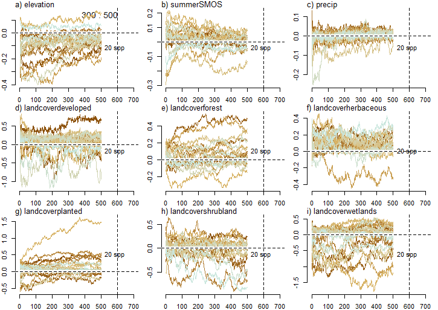
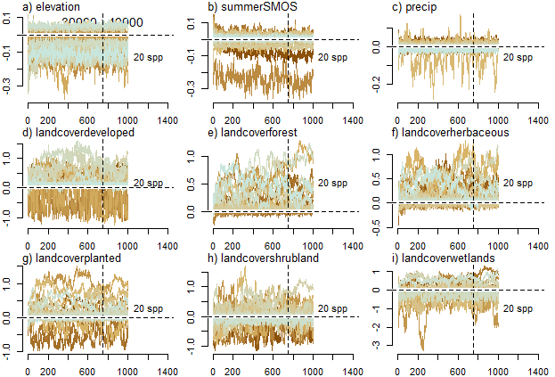
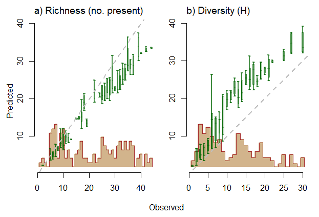
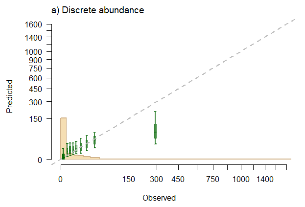
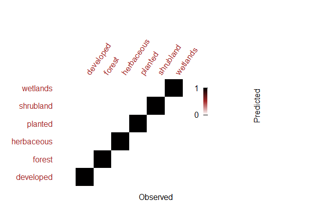
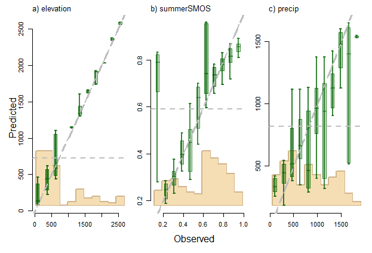
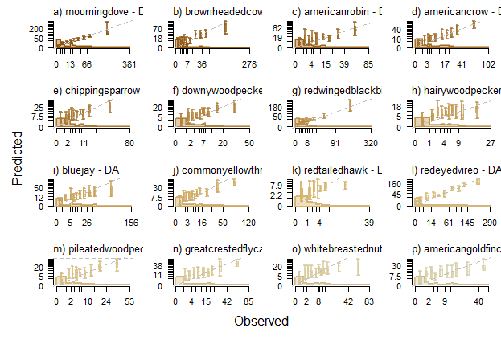
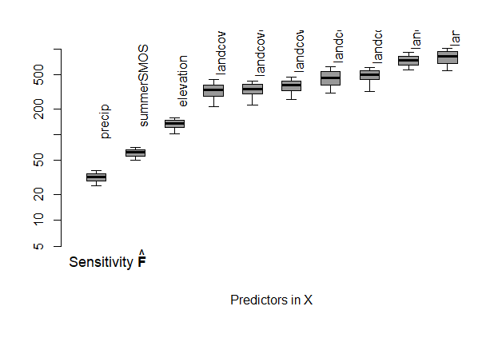
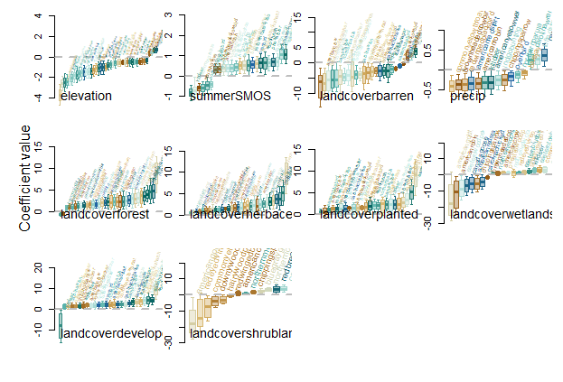

```{r setup, include=FALSE}
knitr::opts_chunk$set(echo = TRUE, fig.align = "center")
```

If you have questions or comments, email me at lane.scher@duke.edu, tweet at me @lane_scher, and find more information on [my website](https://clanescher.wixsite.com/my-site).


## How to use this tutorial
The first part of this tutorial covers the theoretical background of a generalized joint attribute model (GJAM), which is a multivariate hierarchical Bayesian model. GJAM has many uses; in this tutorial, we will focus on its use to develop Species Distribution Models (SDMs). 

Then, I give an example of the code needed to fit a GJAM and interpret the output. In this example, we will use bird abundance data with environmental data to produce a joint species distribution model. 

We use bird data collected by the [National Ecological Observatory Network](https://www.neonscience.org/) (NEON). NEON collects data at sites around the United States and makes the data publicly available on their [data portal](https://data.neonscience.org/data-products/explore). I have already downloaded the raw bird data from NEON and formatted it for use in GJAM. 

The environmental data come from the National Land Cover Database (NLCD), Shuttle Radar Topography Mission (SRTM), NASA-USDA Global Soil Moisture Data, Tropical Rainfall Measuring Mission (TRMM), and MODIS products and were taken from [Google Earth Engine](https://earthengine.google.com/).

This tutorial is meant for people with some experience using r (if you're brand new, check out [one](https://rpubs.com/margaret-swift/715955) [of](https://www.statmethods.net/r-tutorial/index.html) [these](http://www.sthda.com/english/wiki/r-basics-quick-and-easy) [tutorials](https://data-flair.training/blogs/r-tutorial/)). If you're not interested in the coding, feel free to stick to the theory.

Before we get started, install the gjam package from CRAN and load the data.
```{r cars, warning = F, message = F}
#install.packages("gjam")
library(gjam)
library(ggplot2)
library(ggpubr)
library(knitr)
library(cowplot)

# load data
load("birdData.rdata")

# create base for plots
base <- ggplot() +
  theme_bw() +
  theme(panel.background = element_blank(),
        panel.grid = element_blank(),
        plot.title = element_text(hjust = 0.5),
        plot.subtitle = element_text(hjust = 0.5))
```


## Theoretical background

GJAM is a type of joint species distribution model (JSDM). GJAM is built specifically to handle several features of typical ecological data that can make fitting traditional SDMs challenging. Here are some of these features: 

- The response data might be **multifarious**. Ecological data are often collected in different ways---discrete counts, continuous counts, ordinal categories, proportions, etc. GJAM allows data of different types to be included in the response. Further, because GJAM does not use non-linear link functions, the model output has the same units as the observation.  *All species in this example are recorded as discrete abundance counts*
- Observations often have different amounts of **effort**. Depending on the data type, effort could be area surveyed, duration of observation, number of samples, etc. *In this example, effort is measured in minutes and varies across sites and years*
- The data often contain **many zeroes**. Except for very common species, most species will be absent in most samples. *We will see an example of this in our data*


GJAM also addresses some statistical challenges that are often associated with SDMs:

- It models species **jointly**. Because species are not independent (they interact with each other and experience similar environmental conditions), understanding patterns and responses across species requires joint models. *We will model 50 species together* 
- It accounts for **uncertainty** using a Bayesian hierarchical framework. *In this example, observation error may come from different expertise across observers or imperfect counts* 
- It can incorporate **informative priors** that help ensure ecologically sensible results. *We will use our knowledge of bird ecology to inform the model in the example*
- It deals with a large covariance matrix through **dimension reduction**. *In this example, we use dimension reduction to reduce the computing time*

I will address each of these points in detail and explain how GJAM accommodates them.

### Accomodating Ecological Data
Because continuous data from $-\infty$ to $\infty$ are easier to fit in a model, GJAM infers a continuous **latent variable** $W$, from $Y$, which is the observed count data. A latent variable is not observed but is inferred from a measured variable (in this case, $Y$, the count).

Briefly (and explained in more detail below), GJAM uses *partitioning* to turn **multifarious** $Y$ into continuous $W$, using **effort** to determine the size of the partitions. It also assumes the **point mass at 0** in $Y$ is due to censoring at 0, and create a normally distributed $W$ using a *tobit distribution*.

#### Multifarious data
Whereas most SDMs limit data inputs to presence-absence, presence-pseudo-absence, or presence-only, GJAM can incorporate data of many types into one model. 

```{r, echo = F}
library(knitr)
dt <- data.frame(dataTypes = c("`CON`",
                               "`CA`",
                               "`DA`",
                               "`PA`",
                               "`OC`",
                               "`FC`",
                               "`CC`",
                               "`CAT`"),
                 dataLook = c("continuous, uncensored",
                              "continuous abundance",
                              "discrete abundance",
                              "presence-absence",
                              "ordinal counts",
                              "fractional composition", 
                              "count composition",
                              "categorical"),
                 obsVal = c("(-Inf, Inf)",
                            "[0, Inf)",
                            "{0, 1, 2, ...}",
                            "{0, 1}",
                            "{0, 1, 2, ..., K}",
                            "[0, 1]",
                            "{0, 1, 2, ...}",
                            "{0, 1}"))
colnames(dt) <- c("Data types",
                  "Data names",
                  "Observation values")

kable(dt)
```

Often, a link function is used to transform a categorical variable into a continuous variable which can be modeled with a linear regression. For example, a link function might convert a binary variable (presence/absence) to probabilities between 0 and 1. But after using a link function, results cannot be interpreted on the scale of the observation---the relationships identified are between the covariates and the transformed response, not the response itself.

GJAM avoids link functions with *partitioning*. Partitioning is used to translate continuous or discrete $Y$ into a continuous **latent variable** $W$. Depending on the data type, the partitions can be known or unknown. For example, with discrete abundance data, the partitions are spaced evenly between each whole number. For ordinal data (i.e. "rare", "moderate", "abundant"), there is no obvious partition. The partition widths are determined by effort---I will give an example of partitioning in the following section about effort.


#### Effort
In ecological data, each observation can have a different amount of effort. For example, in a forest survey, where each plot is an observation, plots might range in size from 10m x 10m to 100m x 100m. The large plot is more representative of its area than the small plot, and therefore should have more weight in the model. GJAM incorporates this weight by modifying the size of the partitioned intervals when creating the **latent variable** $W$. Consider sample $i$. The partition for a discrete interval $k$ depends on the effort in the sample. 
$$
(p_{i,k}, p_{i,k+1}] = \left ( \frac {k-1/2} {E_{i}} , \frac {k+1/2} {E_{i}} \right ]
$$
When $E$ is large, the interval $k$ becomes small and allows little variance around $w$. If $E$ is small, the interval $k$ is large with high variance. 

We can think about this in terms of our example. Each observation is a point count (actually, several point counts that I've aggregated into one) with a certain amount of effort in minutes. Every observation contains discrete counts of each bird species.  

Let's compare two hypothetical observations. They are discrete abundance (`DA`) counts of a bird species in a forest (remember than an actual observation would include multiple species). 
```{r, echo = F}
eff <- data.frame(obs = 1:2, 
                  count = c(1, 10), 
                  effort = c(10, 100),
                  densityW = c(0.1, 0.1),
                  densityP = c("(0.095, 0.105]", "(0.0995, 0.1005]"))
colnames(eff) <- c("observation", "bird count, y", "duration (minutes), E", "density, w", "partition, p")

kable(eff)
  
```
The count $y$ differs in the two observations, as well as observation duration, or effort, $E$. The latent variable $w$ is continuous, expressed as density (in this case, birds per minute, calculated as $y/E$). $w$ is the same for these two observations. However, the observations differ in the variance of the distribution that $w$ is drawn from: in observation 1, which has lower effort, the variance is large (ie. the partitioned interval is large); in observation 2, the variance is small (ie. the partitioned interval is small). The difference in variance is reflected in the partition $p$, which is calculated as $w \pm 0.5/E$. To visualize:

```{r, echo = F, fig.align="center"}
ob1 <- rnorm(1000000, 0.1, 10)
ob2 <- rnorm(1000000, 0.1, 3)

ggplot() +
  geom_density(aes(x = ob1),
               fill = "turquoise4",
               color = "turquoise4",
               alpha = 0.3) +
  geom_density(aes(x = ob2),
               fill = "sienna",
               color = "sienna",
               alpha = 0.3) +
  theme_bw()+
  theme(panel.background = element_blank(),
        panel.grid = element_blank(),
        plot.title = element_text(hjust = 0.5)) +
  labs(x = "w", y = "",
       title = "Example of latent variable assigned for observations with different effort")+
  geom_text(aes(x = 7, y = 0.1),
            label = "Observation 2 (high effort)",
            color = "sienna",
            hjust = 0) +
  geom_text(aes(x = 10, y = 0.04),
            label = "Observation 1 (low effort)",
            color = "turquoise4",
            hjust = 0)
  
```

$w$ for each observation is drawn from these distributions. This is one of the ways GJAM accounts for uncertainty in the model. For both observations, $w$ is centered at the observed value, but the observation with lower effort has higher uncertainty, so it contributes less to the model fit.


#### Point mass at 0
With species data of any type, the median value is often zero, which means the data are non-normal. Standard regression analyses cannot handle non-normal data so transformations (like a log transformation) are often used to make the data more normal. However, with point mass at 0, these transformations are inappropriate---`log(0)` is undefined.

Instead of attempting to normalize the data, GJAM uses a tobit model, or censored regression model. A tobit regression estimates linear relationships between variables when the response is censored. In this case, we can consider species data to be censored at zero. 

```{r, echo = F, warning = F, message = F, fig.align="center"}

tobW <- rnorm(500, mean = 2, sd = 4)
tobY <- tobW
tobY[tobY < 0] <- 0

base +
  geom_histogram(mapping = aes(x = tobY)) +
  labs(x = "Count", y = "Frequency",
       title = "Example of data censored at 0")

```

The tobit model creates a **latent variable**, $W$ (described earlier), that is normally distributed. The tobit then models $W$ as the response instead of $Y$. $W$ is equal to the response, $Y$, when $Y > 0$. When $Y = 0$, the latent variable is negative. 

$$
y_{is} = \begin{cases} w_{is} &if \enspace w_{is} > 0 \\
                         0     &if \enspace w_{is} \leq 0
          \end{cases} 
$$
where $i$ is the observation and $s$ is the species.

Here, we compare a linear regression (top) with a tobit regression (bottom). The response in the tobit is the latent variable $W$, which is normally distributed. 

```{r, echo = F, warning = F, message = F, out.width = "80%", fig.asp = 1, fig.align = "center"}

tobX <- (tobW*(2)+rnorm(500, 4, 6))
min.y <- min(tobY, tobW)
max.y <- max(tobY, tobW)
min.x <- min(tobX)
max.x <- max(tobX)

max.hist <- max(table(tobY))


base1 <- base +
  geom_abline(slope = 0, intercept = 0,
              color = "gray30") +
  coord_cartesian(xlim = c(min.x, max.x),
                  ylim = c(min.y, max.y))


pl1 <- base1 +
  geom_point(mapping = aes(x = tobX, y = tobY),
             color = "goldenrod2") +
  geom_smooth(mapping = aes(x = tobX, y = tobY),
              method = "lm",
              color = "black",
              se = F) +
  labs(x = "X", y = "Y",
       title = "Linear regression of censored data",
       subtitle = "The censored variable Y is the \ndependent variable")

pl2 <- base1 +
  geom_point(mapping = aes(x = tobX, y = tobW),
             color = "cornflowerblue") +
  geom_smooth(mapping = aes(x = tobX, y = tobW),
              method = "lm", 
              color = "black",
              se = F) +
  labs(x = "X", y = "W",
       title = "Tobit regression of censored data",
       subtitle = "The latent variable W is the \ndependent variable")


hist1 <- base +
  geom_histogram(mapping = aes(tobY),
                 fill = "goldenrod") +
  coord_flip(xlim = c(min.y, max.y),
             ylim = c(max.hist, 0)) +
  scale_y_reverse() +
  labs(x = "", y = "") +
  theme(axis.text = element_blank(),
        axis.ticks = element_blank())


hist2 <- base +
  geom_histogram(mapping = aes(tobW),
                 fill = "cornflowerblue") +
  coord_flip(xlim = c(min.y, max.y),
             ylim = c(max.hist, 0)) +
  scale_y_reverse() +
  labs(x = "", y = "") +
  theme(axis.text = element_blank(),
        axis.ticks = element_blank())

ggarrange(hist1, pl1, hist2, pl2,
          align = "hv",
          widths = c(1, 3, 1, 3))
```

We can see visually that the line fits the data better in the tobit model, when the latent variable $W$ is the response.

### Statistical Challenges

#### Multivariate response
Species interact with each other and experience the same environmental conditions, so they are not independent. Therefore, they cannot be modeled independently. GJAM uses a multivariate normal tobit (see *Point mass at 0*) to model species jointly.


Each observation consists of two vectors, $x$ and $y$. $x$ is a design vector containing the intercept and predictors, which is standard in both univariate and multivariate analyses. However, whereas the response in a univariate model is a single value $y$, in a multivariate model, the response is a length-$S$ vector $y$ (where $S$ is the number of species). The responses in $y$ may be measured in different ways and may have point mass at 0 (as discussed above). The latent variable $w$ contains all the responses on a continuous scale. The vector $w$ has the joint distribution:


$$
  w_{is} \sim MVN(\mu_{i}, \Sigma)
$$

where $\mu_{i}$ is the mean vector (equal to $\beta'_{i} x$) with length $S$, and $\Sigma$ is an $S \times S$ covariance matrix. 


#### Uncertainty

GJAM accounts for uncertainty by using a **hierarchical Bayesian framework**. Bayesian analysis puts distributions on model parameters, rather than assigning a single value. For example, the partitioning described above assigns a distribution to the latent variable based on effort, rather than assuming the observed value is correct. Similarly, Bayesian analysis fits parameters with probability distributions. 


#### Informative Priors
The Bayesian framework of GJAM is also useful because it allows for the inclusion of priors. Priors are useful because they can inform a model based on what we already know about the system. For example, if we know that Great Blue Herons live near water, we can include that in the model as a prior.

Priors influence the estimate of the posterior---this is what they're supposed to do. But this also makes interpretation tricky: it's difficult to determine how much of the posterior comes from the data and how much comes from the prior. A strong prior can overwhelm the data, and then you don't learn anything from the data. For these reasons, the default in GJAM is flat uninformative priors, and it is fine to leave it that way.

There are times, however, when adding informative priors is useful, and GJAM accepts flat priors that restrict a parameter to be positive or negative. If you know that a species should have a positive response to a variable (e.g. a shorebird should be found near water), you can add a prior to ensure that response is positive. If you know that a covariate is not relevant to a species (e.g. a fruit-eating bird doesn't respond to acorn abundance), you can use a prior to prevent any response to that covariate. 


#### Dimension reduction
The covariance matrix $\Sigma$ for a model with many species (i.e. $S$ is large) has $S(S+1)/2$ unique elements. $\Sigma$ must be inverted, which is an operation of order $S^{3}$ and is very computationally difficult. Even when $\Sigma$ can be inverted, there may not be enough observations to estimate all parameters in the model. GJAM handles this problem by finding a lower dimension $N \times r$ approximation of $\Sigma$. GJAM does this by finding responses that have similar relationships with the predictors, otherwise known as finding structure in $\Sigma$.

Be warned: dimension reduction essentially adds an arbitrary random effect to the model. This can improve the fit of the model but might make out-of-sample prediction worse.

**Note:** dimension reduction can occur automatically if 1) the dataset includes more species $S$ than can be fitted given the sample size $n$, or 2) if $S$ is too large, regardless of $n$. Check the Results section for a way to tell if dimension reduction was used.


## An example

Let's look at the code for the example we've been talking about. NEON collects bird abundance data in a series of point counts each summer. We'll treat each site-year as an observation. Each point count is six minutes, but the number of point counts varies across sites and across years, so each observation can have a different effort.


### The Data

The `birdData.rdata` file contains three objects:

- `ydata`: a dataframe containing bird counts at each site-year
- `xdata`: a dataframe containing environmental data at each site-year
- `edata`: a list containing effort data for each site-year

In `ydata` and `xdata`, each row is an observation. The two objects have the same number of rows in the same order. `ydata` has one column for each species; `xdata` has one column for each covariate. Here, their row names match.

We can see they have the same number of rows but different numbers of columns:
```{r, collapse = T}
dim(xdata)

dim(ydata)
```

Let's look at a small portion of each data frame. You can see from the row names that the rows are in the same order across the two dataframes. This is very important!

```{r, collapse = T}
xdata[1:5, ]

ydata[1:5, 1:5]

```

The columns in `ydata` are species names. The columns in `xdata` are the following:

- `geeIDyear`: NEON site ID and year
- `geeID`: NEON site ID
- `elevation`: mean elevation at the site
- `landcover`: the most abundant land cover type at the site
- `summerSMOS`: mean soil moisture at the site in that summer
- `precip`: total precipitation at that site in the previous 12 months
- `summerLAI`: leaf area index at the site in that summer


We can see the *point mass at zero* even in the distribution of counts of American crow, which is a relatively common bird. A rare species would have even more observations of 0.
```{r, message = F, warning = F, fig.align="center"} 
base +
  geom_histogram(aes(x = ydata$`american crow`)) +
  labs(title = "Distribution of American crow",
       y = "Frequency", x = "Counts of American crow")
```


Here, `edata` is a vector with one element for each observation. The order of the elements matches the order of the observations in `xdata` and `ydata`. The *effort varies* across observations:
```{r, message = F, warning = F, fig.align="center"}
base +
  geom_histogram(aes(x = edata)) +
  labs(title = "Distribution of effort",
       y = "Frequency", x = "Effort (minutes)")
```

In our example, each observation has a different effort, but within an observation, effort is constant across species. There may be cases where effort varies across species in a single observation (e.g. in a forest survey, trees may be surveyed in 20mx20m plots, and herbaceous plants may be surveyed in 3mx3m plots). In that case, `edata` can be a dataframe, with each column representing a species. The order of the columns should match the order of the columns in `ydata`.


### The Model

#### Input data

Right now, `ydata` contains 415 species. This is too many to model, especially because many species are seen in very few observations. Use `gjamTrimY` to reduce the number of species in the model. Here, we choose to keep the 50 species that are seen in the most observations (`maxCols = 50`). We could also use `minObs = ` to keep species based on the number of observations in which they are reported.
```{r}
ydata <- as.data.frame(gjamTrimY(ydata[,1:ncol(ydata)], maxCols = 50)$y)
ydata <- sapply(ydata, as.numeric)
ydata <- as.data.frame(ydata)

```

In `xdata`, `landcover` should be a factor. Convert it to a factor and set the reference level---here, we set "barren" as the reference level. GJAM will fit coefficients for each factor relative to the reference level (e.g. forest has X effect on abundance relative to barren).
```{r}
xdata$landcover <- as.factor(xdata$landcover)
xdata$landcover <- relevel(xdata$landcover, 
                           "barren")
```

Now that we have reduced the number of species $S$ in `ydata`, we can put `edata` into the correct format. It should be a list with two elements. The first is a vector of length $S$ holding numbers 1 through $S$. The second is a vector of length $Q$ holding the effort for each observation. If effort varies across species, the second element is a dataframe holding the effort for each species in each observation.
```{r}
elist <- list(columns = 1:ncol(ydata),
               values = edata)
```


#### Setting up the model

GJAM uses standard R syntax to set up the **formula**:
```{r}
form1 <- as.formula(~ elevation + summerSMOS + precip + landcover)
```
Each element in the formula corresponds to a column in `xdata`.


Create `rlist`, which contains $N$ and $r$ for **dimension reduction**. $N$ is the potential number of response groups, and $r$ is the dimensionality (AKA flexibility) of those groups. $r$ must be smaller than $N$, which should be much smaller than the number of species $S$. 
```{r}
rlist   <- list(r = 8, N = 20)
```

Now let's set up the **priors**. We start by making two lists: `hi` and `lo`. Within each list, a species-response combination can be set to `Inf`, `-Inf`, or `0`, which dictates the upper (`hi`) and lower (`lo`) bounds of the coefficient. If a species-response combination is set to `Inf` in both `hi` and `lo`, the coefficient can range from $-\infty$ to $\infty$. If `lo` is set to 0, the coefficient can range from 0 to $\infty$. If both `hi` and `lo` are 0, the coefficient is 0.

For this example, let's say that Great Blue Heron should have a positive response to the wetland cover type. We create a list called `lo` holding elements that are named with the species-response combination and contain `0`.
```{r}
spLo <- "great blue heron"
sp <- length(spLo)
lo <- vector("list", sp)

# add names to the list
names(lo) <- paste0("landcoverwetlands_", spLo)

# add values to the list
lo[1] <- 0
```

For fun (and to practice), let's also say that a group of species should have negative responses to precipitation. Now we make a list called `hi` in the same way.
```{r}
spHi <- c("blue jay", "northern parula", "killdeer", "chipping sparrow", "ovenbird")
sp <- length(spHi)
hi <- vector("list", sp)

# add names to the list
names(hi) <- paste0("precip_", spHi)

# add values to the list
hi[1:length(hi)] <- 0
```

We use the function `gjamPriorTemplate` to create the prior for the model.
```{r}
prior <- gjamPriorTemplate(formula = form1, 
                           xdata = xdata, ydata = ydata,
                           lo = lo, hi = hi)
```

We now have a two-element list, `prior`, that contains `hi` and `lo`. Each element contains a dataframe with values (`-Inf`, `Inf`, or `0`) representing the upper or lower bounds of the prior. Note that for the species-response combinations that we did not specify, the coefficient can range from $-\infty$ to $\infty$.

The **model list** `mlist` contains all the information needed for the model to run. That includes the number of iterations for the Gibbs sampler (`ng`), the number of iterations to discard from the beginning of the chain (`burnin`), the data types (`typeNames`), `prior`, `elist`, and `rlist`.
```{r}
mlist <- list(ng=500, burnin=300, typeNames = 'DA', betaPrior = prior,
                  effort = elist, reductList = rlist)
```
*Note: `ng` and `burnin` should be longer, but for a test this is sufficient. The model should be run long enough for the chains to converge. See the Output section for an explanation of how to check the chains for convergence*


Now, run the model:
```{r}
out <- gjam(form1, xdata = xdata, ydata = ydata, modelList = mlist)
```


### The Output


The gjam output is stored in an object `out` that contains a lot of information. Here are a few useful items:

- `out$inputs$xdata`, `out$inputs$y`, and `out$inputs$effMat` holds the xdata, ydata, and effort used to fit the model
- `out$modelList` contains the objects that were put into the model list, like the formula, burnin, prior, effort, and dimension reduction
- `out$fit` holds the DIC, mean RMSPE across species, and RMSPE for each species
- `out$chains$bgibbs` has the beta chains for each species and covariate
- `out$parameters$betaTable` and `out$parameters$betaStandXTable` are the unstandardized and standardized fitted beta coefficients, respectively 
- `out$parameteres$sensTable` contains information about the community sensitivity to each covariate
- `out$prediction$ypredMu` has in-sample predictions for each species in each observation

To check if dimension reduction was used in the model, look for `out$parameters$rndEff`. If this object exists, dimension reduction occurred and the model fitted a random effect.

#### Chain convergence
GJAM uses Gibbs sampling to obtain the posterior distributions of the parameters. It is important to make sure the chains have converged. If the chains haven't converged, the results are meaningless. Converged chains should look like fuzzy caterpillars. 

The beta chains are stored in `out$chains$bgibbs`. Each column is a species-parameter combination, and each row is a step in the chain.
```{r, collapse = T}
dim(out$chains$bgibbs)

colnames(out$chains$bgibbs)[1:6]
```

The beta chains are also plotted by the `gjamPlot()` function (more about that function below). Each plot is a covariate, and the function randomly chooses 20 species to show.

<center>



</center>

The chains in the above figure have not converged, which we expect when `ng` is small. I reran the model with `ng = 40000` and `burnin = 20000` and show the chains here:

<center>



</center>

For many covariates, the chains are much more stable, although the coefficients for the landcover factors may not have converged quite yet. The rest of the output shown in this tutorial will be from the second model. Your results might not match these, but if you run the model for longer you should get very similar results.


#### Model fit
To assess model fit, here are a few things in the output you can look at:

```{r, collapse = T}
# DIC
out$fit$DIC

# mean RMSPE across species
out$fit$rmspeAll

# RMSPE for each species (only show the first 10 species)
out$fit$rmspeBySpec[1:10]
```
You might also want to plot observed vs. predicted for a species. We take the observed values from `out$inputs$y` and the predicted values from `out$prediction$ypreMu`.
```{r}
# make plot for first species, Mourning Dove
md <- base +
  geom_point(aes(x = out$inputs$y[,1],
                 y = out$prediction$ypredMu[,1])) +
  labs(x = "observed", y = "predicted", title = paste0(colnames(out$inputs$y)[1], ", common"))

# make plot for a less common species, American Redstart
ar <- base +
  geom_point(aes(x = out$inputs$y[,48],
                 y = out$prediction$ypredMu[,48])) +
  labs(x = "observed", y = "predicted", title = paste0(colnames(out$inputs$y)[48], ", uncommon"))


ggarrange(md, ar, 
          ncol = 2)
```
The predictions for the common species are much better.

#### GJAM Plots

The `gjamPlot()` function produces a set of useful figures. All of these plots can be generated manually from the gjam output, but `gjamPlot()` does it for you. 

I will add the optional argument `plotPars`, which is a list that is used to customize the output. I will use `PLOTALLY = T`, which will produce observed vs. predicted plots for each species. 

`SAVEPLOTS = F` will save the plots to the file specified by `outfolder`. Both `SAVEPLOTS` and `outfolder` go in the `plotPars` list.
```{r, eval = F}
gjamPlot(output = out, plotPars = list(PLOTALLY = T))
```

The first plot produced by `gjamPlot()` shows observed vs. predicted plots for **richness and diversity**. As in all the observed vs. predicted plots from `gjamPlot()`, the brown shows the distribution of the observed data, the dotted line shows the one-to-one line, and the green shows the predicted values. In the standard `gjamPlot()` output, only in-sample prediction is shown.

<center>



</center>

The next plot shows observed vs. predicted for **abundance** of all species.

<center>



</center>

The next set of figures shows **inverse prediction**, meaning the covariates are predicted from the response data. This is useful for variable selection---a covariate that is predicted well is important in the model. Factor covariates will be shown first. 

<center>



</center>

The diagonal is black, meaning cover type is predicted correctly for almost all observations.

Continuous covariates are shown next. An additional horizontal dashed line is added here to represent the mean observed value. Predicted values will likely fall somewhere between the one-to-one line and the mean line. In this figure, the predicted values fall along the one-to-one line, meaning the covariates are predicted well.

<center>



</center>

If `PLOTALLY = T` in `plotPars`, the next few figures will show observed vs. predicted **abundance** for each species in the model. Boxes falling along the one-to-one line indicate good predictions. There will likely be several of these plots to show all species.

<center>



</center>

The next figure shows community **sensitivity** to each covariate. The sensitivity shows how important a covariate is in explaining the joint response of all species modeled. A high value for a covariate means that overall, species respond strongly to it. 

<center>



</center>

The next figures show **beta chains**, as described above under *Chain Convergence*.


Finally, the last few figures show **beta coefficient** estimates for each covariate one at a time, and then all together. By default, each plot shows only the species whose credible interval does not cross 0 for that covariate. The beta coefficient represents the response of a species to a covariate.

<center>



</center>


## Warnings

SDMs assume that the species they model are at equilibrium with the environment. GJAM also makes this assumption. Here are some examples of cases when this assumption is not met:

- **The species is a recent invader.** In this case, the species may not be occupying the full range of environmental conditions that it can tolerate. In fact, the area of introduction is a somewhat random subset of the species’ full range. Therefore, an SDM would identify only a small portion of the n-dimensional niche space that may not even the optimal conditions.
- **The species is long-lived.** For example, the current environmental conditions of a forest may not be the optimal conditions for the trees to persist. But because trees are so long-lived, we do not see a change in the forest yet.
- **The species exists in sink populations.** Due to migration across populations, a species can persist in an area outside of its niche space (“sink population”). As long as individuals continually migrate from a growing population (“source population”), the sink population can persist indefinitely. An SDM would incorrectly identify the environmental conditions at the sink population as part of the species’ suitable habitat.

Further, GJAM should be thought of as an **abundance-weighted habitat suitability model**. That is, it can predict suitable habitat and abundance of individuals that can live there. It does *not* model species ranges. A species does not necessarily occur in all regions predicted as suitable habitat due to limitations to its dispersal.

Finally, the covariance matrix in GJAM's output is **not a species interaction matrix**. It simply shows where species are more or less likely to occur together after accounting for the environmental conditions in the model. Some of this co-occurence might be due to species interactions, but there is no way to tell from the model. It is likely that at least some of the co-occurence is in response to an environmental feature that is not included in the model.


## Additional resources

The original paper describing GJAM:
Clark, James S., et al. "Generalized joint attribute modeling for biodiversity analysis: Median‐zero, multivariate, multifarious data." Ecological Monographs 87.1 (2017): 34-56.


A [vignette](https://cran.r-project.org/web/packages/gjam/vignettes/gjamVignette.html) by Jim Clark, the author of GJAM, that explains many pieces in more detail.


A [workshop](https://rpubs.com/clanescher/710083) developed by James S. Clark, Jennifer J. Swenson, Christopher L. Kilner, Taylor J. Minich, Chase L. Nunez, C. Lane Scher, Amanda M. Schwantes, Shubhi Sharma.


